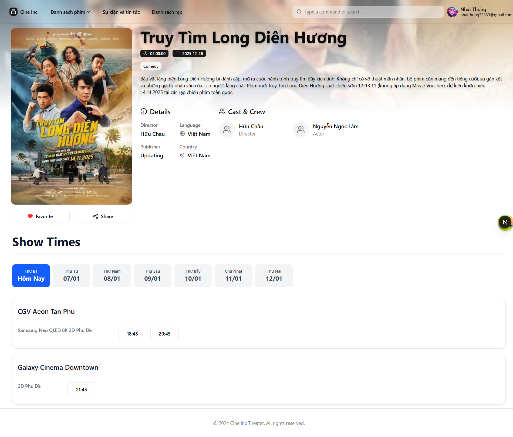
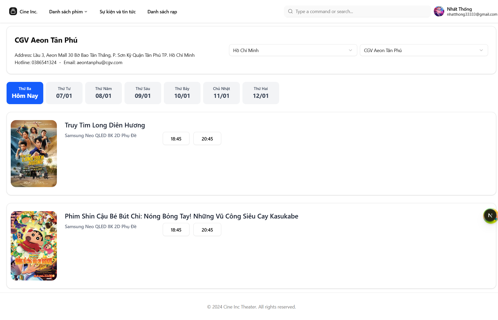
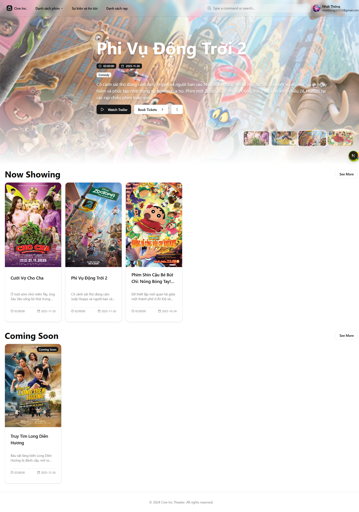
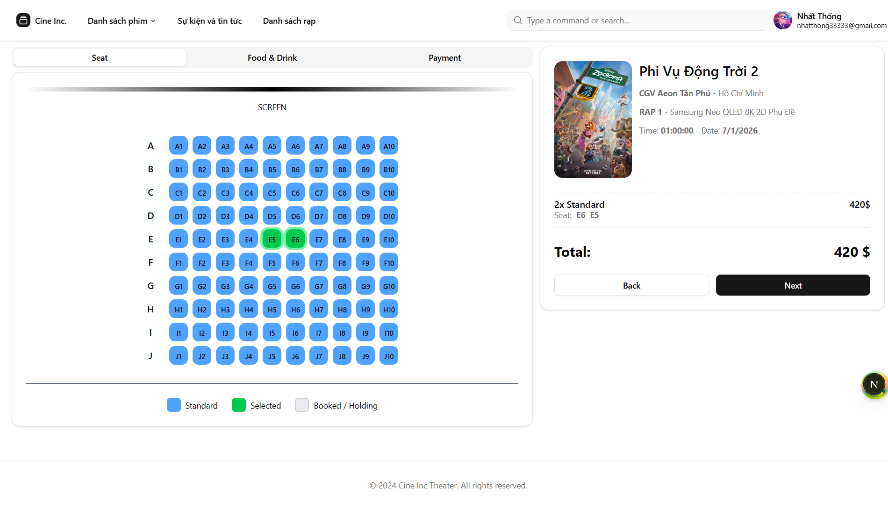
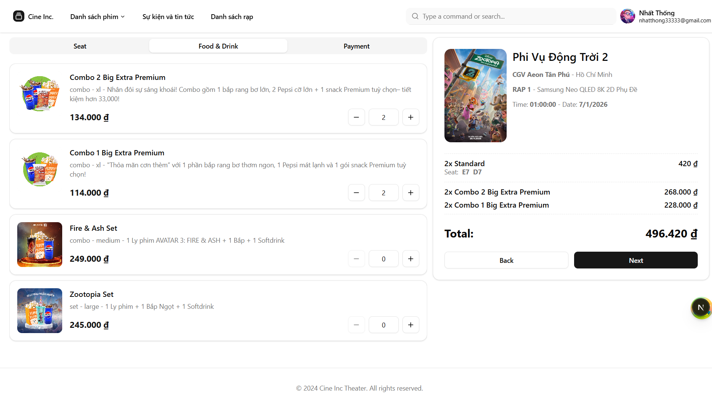
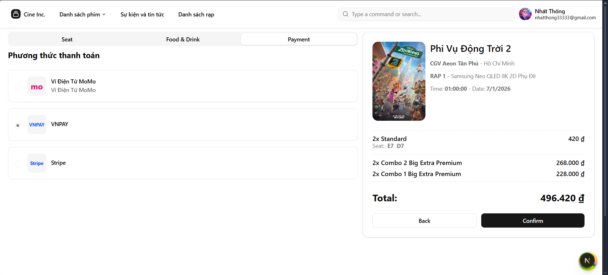
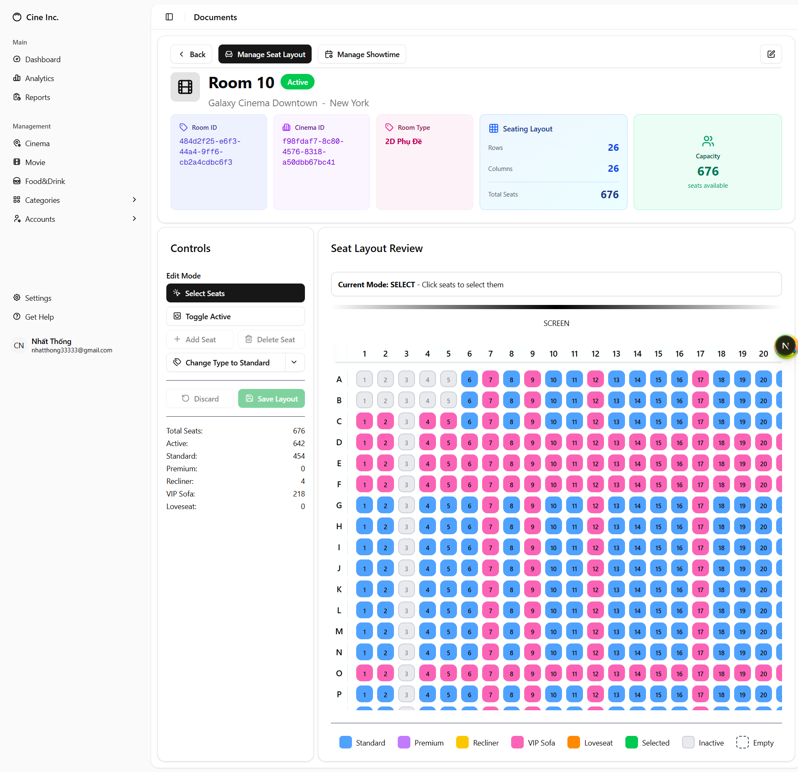
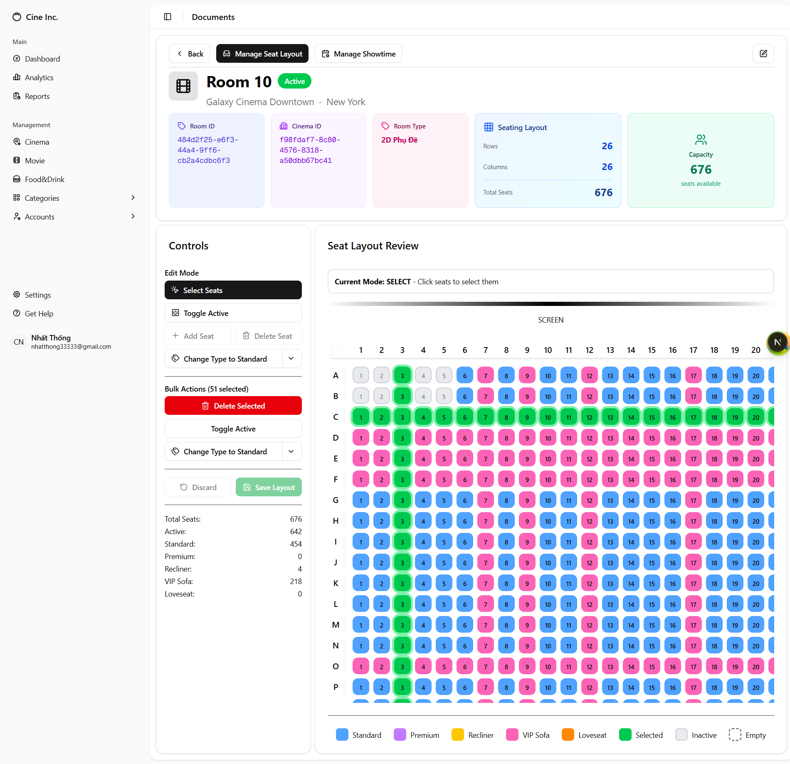

# 🎬 Cinema Management System • Full-Stack Next.js + .NET gRPC Platform (Ongoing)

[](https://nextjs.org/)
[](https://react.dev/)
[](https://www.typescriptlang.org/)
[](https://tailwindcss.com/)
[](https://dotnet.microsoft.com/)
[](https://grpc.io/)
[]( )

A **full-featured cinema management platform** designed to handle movie scheduling, seat management, ticket booking, and operational dashboards.
The system focuses on **scalability, clean architecture, and real-world frontend–backend collaboration**.

---

## 📸 Screenshots
<table>
  <tr>
    <td align="center">
      
      <br><em>Movie Details and Showtime Selection By Movie</em>
    </td>
    <td align="center">
      
      <br><em>Showtime Selection By Cinema</em>
    </td>
    <td align="center">
      
      <br><em>Home page</em>
    </td>
    <td align="center">
      
      <br><em>Real-time Seat Availability</em>
    </td>
  </tr>
  <tr>
    <td align="center">
      
      <br><em>Ticket Booking Flow</em>
    </td>
    <td align="center">
      
      <br><em>Payment & Confirmation</em>
    </td>
    <td align="center">
      
      <br><em>Interactive Seat Map</em>
    </td>
    <td align="center">
      
      <br><em>Interactive Seat Map</em>
    </td>
  </tr>
</table>

*(Replace the paths above with your actual screenshot files once uploaded to the repo.)*

---

## Table of Contents

- [Key Features](#-key-features)
- [Screenshots](#-screenshots)
- [System Architecture](#-system-architecture)
- [My Role](#-my-role)
- [Tech Stack](#-tech-stack)
- [Frontend Architecture Highlights](#-frontend-architecture-highlights)
- [Project Status](#-project-status)
- [Getting Started](#-getting-started)
- [Code Quality & Tooling](#-code-quality--tooling)
- [Why This Project Matters](#-why-this-project-matters)
- [Takeaway for Recruiters](#-takeaway-for-recruiters)

---

## ✨ Key Features

* 🎥 Movie & showtime management
* 🪑 Interactive seat selection with real-time availability
* 🎟️ Ticket booking workflows
* 📊 Admin dashboards & data visualization
* 🔐 Authentication-aware UI flows
* ⚡ Optimized data fetching and caching

---

## 🛡️ Project Status

This project is **actively under development**.  
Upcoming focus areas:

* Role-based access control (RBAC)
* Performance profiling & optimization
* Improved real-time seat availability handling
* Deployment & environment configuration

---

## 🧱 System Architecture

This project follows a **frontend–backend separated architecture** with clear contracts:

* **Frontend**: Built with Next.js using a scalable component and state architecture
* **Backend**: Implemented in ASP.NET Core using **gRPC** for strongly typed, contract-first communication
* **Communication**: gRPC APIs consumed and normalized at the frontend boundary

> The goal is to treat the frontend as a **first-class system**, not just a UI layer.

---

## 🧑‍💻 My Role

**Frontend Engineer (Owner)**  
I am fully responsible for **frontend architecture, implementation, and integration**, while collaborating with a backend teammate on API contracts.

Responsibilities include:

* Designing frontend architecture and folder structure
* Implementing complex UI interactions (seat selection, dashboards)
* Managing async server state, caching, and invalidation
* Handling API error states and loading strategies
* Coordinating API contracts with backend via gRPC
* Ensuring code quality, consistency, and scalability

---

## 🛠️ Tech Stack

### Frontend

* Next.js (App Router)
* React 19 + TypeScript
* Tailwind CSS + Radix UI primitives
* Zustand (client-side state)
* TanStack React Query (server state & caching)
* React Hook Form + Zod (form handling & validation)
* DnD Kit (drag & drop interactions)
* Recharts (data visualization)

### Backend (Collaborator)

* ASP.NET Core
* gRPC (contract-first APIs)

---

## 📐 Frontend Architecture Highlights
This project follows **Feature-Sliced Design** principles adapted for Next.js App Router, ensuring high modularity, scalability, and clear boundaries.

### Key Principles
- **Feature-Sliced**: Each domain/feature is self-contained in `features/` (logic, state, API, queries)
- **UI vs Logic Separation**: `app/` handles routing and page-level UI (Server Components); `features/` owns business logic
- **State Management**: TanStack React Query for server state; Zustand only for client/UI state
- **Developer Experience**: Path aliases (`@/`) eliminate relative import hell
- Review: [project-structure.md](docs/project-structure.md)

### 1️⃣ Server State vs Client State

* **React Query** is used for all remote data: automatic caching, background refetching, optimistic updates
* **Zustand** is reserved for UI-level state, cross-page interactions, and non-server concerns

This avoids common overuse of global state.

### 2️⃣ Contract-Aware API Integration

* gRPC responses normalized at the frontend boundary
* UI components isolated from transport-level concerns
* Errors mapped into user-friendly UI states

Keeps components **stable even if backend evolves**.

### 3️⃣ Scalable UI System

* Radix UI primitives + Tailwind utilities
* Class Variance Authority for consistent variants
* Accessible components by default
* Reusable patterns for dialogs, forms, tables, and dashboards

### 4️⃣ Real-World UX Considerations

* Skeleton loading & optimistic UI
* Graceful empty & error states
* Responsive layouts for admin & operator use cases
* Keyboard and accessibility support

### 5️⃣ Secure Authentication & Token Management

* **Hybrid token storage**: Access token stored in memory via Zustand (secure, short-lived), refresh token handled via httpOnly cookies
* **Automatic token refresh**: Centralized `ApiClient` intercepts 401 responses, refreshes access token once (using a shared promise to prevent race conditions), and retries the original request
* **Seamless user experience**: Background refreshes keep the user authenticated without interruptions or full-page reloads
* **Route protection**: Next.js middleware guards protected routes by checking for the presence of the refresh token cookie, redirecting unauthenticated users gracefully

This pattern balances security (no tokens exposed to XSS) with excellent UX and reliability in a real-world SPA.

---

## 🧪 Code Quality & Developer Workflow

This project enforces high standards through automated tooling, ensuring consistency, readability, and a clean git history — essential for real-world collaboration.

### Tools & Enforcement
- **ESLint + Prettier**: Strict linting and auto-formatting for consistent code style
- **Husky + lint-staged**: Git hooks that run checks automatically
  - On **pre-commit**: Lints and formats staged files only (fast, no full-repo scans)
  - On **commit-msg**: Validates commit message format
- **Commitlint**: Enforces **Conventional Commits** standard with custom rules
  - Required structure: `<type>(<scope>): <subject>`
  - Allowed types: `feat`, `fix`, `docs`, `style`, `refactor`, `perf`, `test`, `chore`, `ci`, `build`, `revert`
  - Scope mandatory, header ≤100 chars, no trailing period

### Benefits
- Clean, semantic git history (great for changelogs via tools like `standard-version`)
- Prevents bad code/merges from entering main
- Smooth onboarding for collaborators

### Example Workflow Visuals
> Example valid commit: `feat(seat-selection): add real-time availability locking`

---

## 🚀 Getting Started

This repository contains the **frontend** of the Cinema Management System.  
The backend (.NET + gRPC) is maintained separately by a collaborator.
Here is the backend repository: [backend-repository](https://github.com/Yahaik4/MovieTheater_SourceCode_Backend.git)

### Prerequisites
- Node.js 18+ (recommend using pnpm or npm)
- Git

### Frontend Setup
```bash
# 1. Clone the repository
git clone https://github.com/SlowHand0302/FE_MovieTheater.git
cd FE_MovieTheater

# 2. Install dependencies
pnpm install

# 3. Create environment file 
cp .env
# Edit .env with required values like .env.example file that I have already included

# 4. Start development server
pnpm run dev
